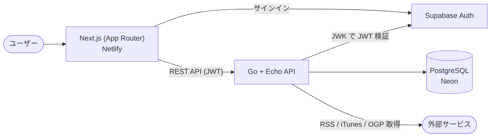
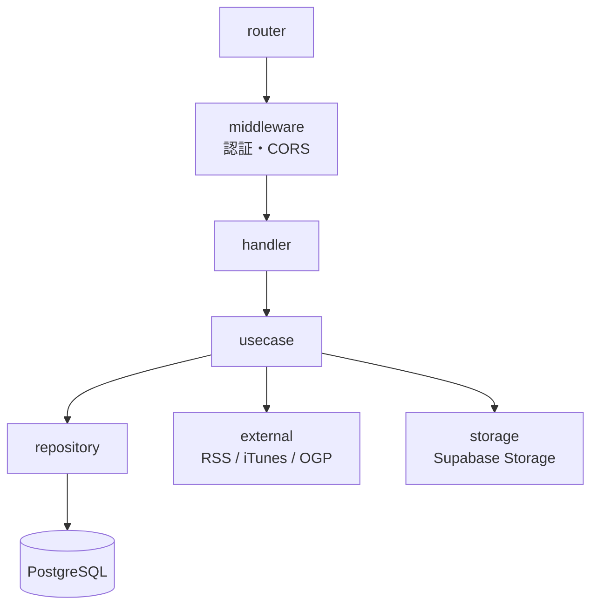

# PodLog

> ラジオを聴いたら、ここに置いていく。ひとことでも、長文でも。
> 同じ回を聴いた人の感想に、いつでも会いに行ける。

聴いたラジオ・ポッドキャストを記録し、感想で繋がる Web アプリです。

**Live Demo: https://podlog.netlify.app/**


---

## なぜ作ったか

ラジオの神回を聴いた後、X で他の人の感想を探すことがある。「自分もそこ最高だと思った」と
共感したいし、自分が気づかなかった解釈も読みたい。でも X はラジオの感想を残す場所として
設計されていない — 感想は流れて蓄積されず、回ごとに集約されず、リアタイ偏重で過去回の
感想は届きにくい。

PodLog は、**ラジオの感想が回ごとに集まり、いつでも会いに行ける場所**を目指して作っています。

### コアバリュー

- **記録する** — 聴いた回を記録し、自分のラジオライブラリが積み上がる
- **共感する** — 同じ回を聴いた人の感想を読み、自分も感想を残せる（X のように流れない）
- **出会う** — 共感した人の聴取履歴から、次に聴くラジオと出会う

## 主な機能

- **認証** — Google アカウントでかんたんにログイン
- **探す** — 番組検索・人気番組・ジャンル別ブラウズで新しい番組と出会う
- **エピソード閲覧** — 番組ごとのエピソード一覧・詳細
- **聴取記録 (Mark)** — エピソードを「聴いた」として記録
- **評価 (Rating)** — エピソードに 1〜5 の星評価
- **感想 (Comment)** — エピソードに自由なテキストを投稿
- **ホーム・タイムライン** — 全ユーザーの最新の感想を表示
- **ユーザーページ** — 公開プロフィール・聴取履歴・感想一覧

## 技術スタック

| レイヤー | 技術 | 選定理由 |
|---|---|---|
| フロントエンド | Next.js (App Router) / TypeScript | Server Components による高速な初期表示と、型安全な開発のため |
| バックエンド | Go / Echo | 軽量・高速な API。静的型付けと書きやすい並行処理で保守性を確保 <!-- 要編集: 学習目的など本音の理由も◎ --> |
| データベース | PostgreSQL 17 (Neon) | リレーショナルなデータ構造に最適。Neon のサーバーレス構成で運用コストを抑制 |
| 認証 | Supabase Auth | 認証基盤は自前実装せず、Google ログイン + JWT (JWK) 検証のみ自前で行い開発を加速 |
| インフラ | Docker / Docker Compose | ローカル開発環境を 1 コマンドで再現 |
| ホスティング | Netlify (フロントエンド) | <!-- 要確認: バックエンドのホスティング先（Cloud Run 等）があれば追記 --> |
| CI | GitHub Actions | lint / 型チェック / テスト / ビルドを自動実行 |
| API ドキュメント | Swagger (OpenAPI) | ハンドラーのコメントから API 仕様を自動生成 |

## アーキテクチャ

### システム全体



### バックエンド（レイヤードアーキテクチャ）

責務を `handler → usecase → repository` の層に分離し、各層の独立性とテスト容易性を確保しています。



### ディレクトリ構成

```
podlog/
├── frontend/                   # Next.js アプリ
│   ├── src/
│   │   ├── app/                # App Router ページ
│   │   ├── components/         # UI コンポーネント
│   │   ├── hooks/              # カスタムフック
│   │   └── lib/                # API クライアント・ユーティリティ
│   ├── .storybook/             # Storybook 設定
│   └── docs/                   # 画面仕様・デザイン資料
├── backend/                    # Go API サーバー
│   ├── cmd/                    # エントリポイント
│   │   ├── server/             #   API サーバー本体
│   │   ├── migrate/            #   DB マイグレーション
│   │   ├── backfill-episodes/  #   エピソード補完バッチ
│   │   └── backfill-genre/     #   ジャンル補完バッチ
│   ├── internal/
│   │   ├── handler/            # HTTP ハンドラー
│   │   ├── usecase/            # ビジネスロジック
│   │   ├── repository/         # データアクセス
│   │   ├── middleware/         # 認証・CORS など
│   │   ├── external/           # RSS / iTunes / OGP 連携
│   │   ├── storage/            # Supabase Storage 連携
│   │   └── model/              # ドメインモデル
│   └── docs/                   # API 設計書・DB 仕様書・Swagger
├── docker-compose.yml
└── .github/workflows/          # CI
```

## 開発体制・品質への取り組み

個人開発ですが、チーム開発に近い品質プロセスで進めています。

- **Conventional Commits** — `feat:` / `fix:` / `docs:` 等で変更履歴を整理
- **PR ベース開発** — 1 PR = 1 機能 / 1 レイヤーを基本に、変更を小さく保つ
- **多重コードレビュー** — CodeRabbit / GitHub Copilot による自動レビューを併用
- **テスト** — Go (`go test -race`) / Jest + React Testing Library / Storybook
- **CI (GitHub Actions)** — push 前と同じ lint / 型チェック / テスト / ビルドを自動実行
- **API ドキュメント** — Swagger (OpenAPI) をハンドラーコメントから自動生成

## セットアップ

```bash
# 1. 環境変数を設定
cp .env.example .env
# .env を編集して SUPABASE_URL などを設定

# 2. Docker Compose で起動（API + DB）
cd backend && make up

# 3. フロントエンドを起動（別ターミナル）
cd frontend && npm install && npm run dev
```

### アクセス

| サービス | URL |
|---|---|
| フロントエンド | http://localhost:3000 |
| API サーバー | http://localhost:8080 |
| Swagger UI | http://localhost:8080/swagger/index.html |

## 今後の展望

- フォロー・フォロワーとフォロー中タイムライン
- 番組推薦（共起ベースのレコメンド）
- 通知機能
- Spotify, radiko 連携

---

> このリポジトリは個人開発プロジェクトです。
