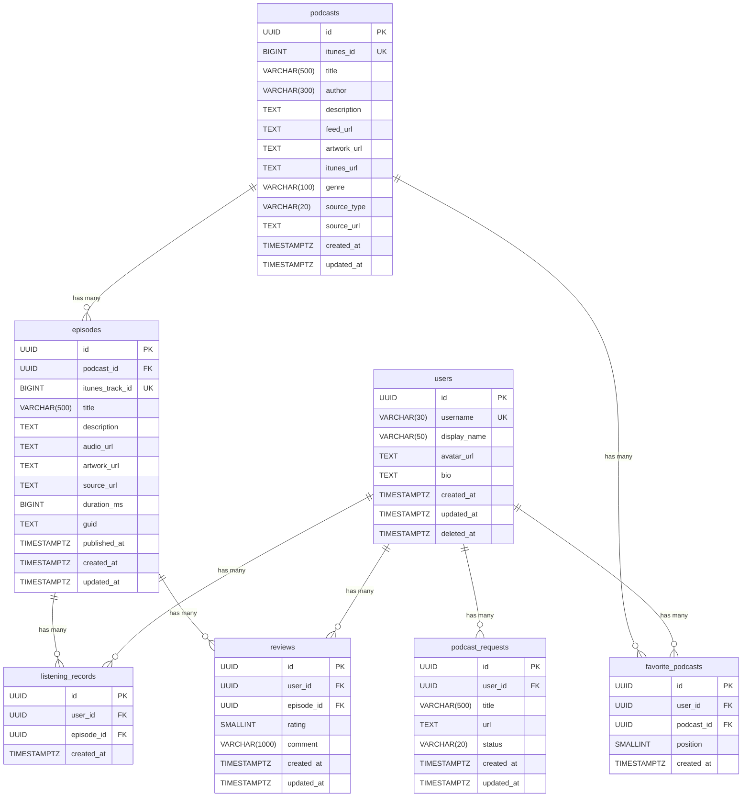

# データベース仕様書

## ER 図

## テーブル定義

### users

Supabase Auth の `auth.users.id` と同じ UUID を PK として使用する。

| カラム | 型 | NULL | デフォルト | 説明 |
|---|---|---|---|---|
| id | UUID | NO | gen_random_uuid() | PK。Supabase Auth の user ID と一致 |
| username | VARCHAR(30) | NO | - | ユニーク。公開プロフィールの URL に使用 |
| display_name | VARCHAR(50) | NO | - | 表示名 |
| avatar_url | TEXT | YES | - | アバター画像 URL |
| bio | TEXT | YES | - | 自己紹介文 |
| created_at | TIMESTAMPTZ | NO | NOW() | 作成日時 |
| updated_at | TIMESTAMPTZ | NO | NOW() | 更新日時 |
| deleted_at | TIMESTAMPTZ | YES | - | ソフトデリート用。NULL = 有効 |

### podcasts

ポッドキャスト番組。iTunes / Radiko / 手動入力の3ソースに対応。

| カラム | 型 | NULL | デフォルト | 説明 |
|---|---|---|---|---|
| id | UUID | NO | gen_random_uuid() | PK |
| itunes_id | BIGINT | YES | - | iTunes の ID。iTunes 以外は NULL |
| title | VARCHAR(500) | NO | - | 番組タイトル |
| author | VARCHAR(300) | YES | - | 配信者名 |
| description | TEXT | YES | - | 番組説明 |
| feed_url | TEXT | YES | - | RSS フィード URL |
| artwork_url | TEXT | YES | - | アートワーク画像 URL |
| itunes_url | TEXT | YES | - | iTunes ページ URL |
| genre | VARCHAR(100) | YES | - | ジャンル |
| source_type | VARCHAR(20) | NO | 'itunes' | ソース種別: 'itunes' / 'radiko' / 'manual' |
| source_url | TEXT | YES | - | 元ソースの URL |
| created_at | TIMESTAMPTZ | NO | NOW() | 作成日時 |
| updated_at | TIMESTAMPTZ | NO | NOW() | 更新日時 |

### episodes

ポッドキャストのエピソード（回）。podcasts と 1:N の関係。

| カラム | 型 | NULL | デフォルト | 説明 |
|---|---|---|---|---|
| id | UUID | NO | gen_random_uuid() | PK |
| podcast_id | UUID | NO | - | FK → podcasts.id（CASCADE DELETE） |
| itunes_track_id | BIGINT | YES | - | iTunes のトラック ID |
| title | VARCHAR(500) | NO | - | エピソードタイトル |
| description | TEXT | YES | - | エピソード説明 |
| audio_url | TEXT | YES | - | 音声ファイル URL |
| artwork_url | TEXT | YES | - | エピソード固有のアートワーク URL |
| source_url | TEXT | YES | - | 元ソースの URL |
| duration_ms | BIGINT | YES | - | 再生時間（ミリ秒） |
| guid | TEXT | YES | - | RSS フィードの GUID。重複検知用 |
| published_at | TIMESTAMPTZ | YES | - | 公開日時 |
| created_at | TIMESTAMPTZ | NO | NOW() | 作成日時 |
| updated_at | TIMESTAMPTZ | NO | NOW() | 更新日時 |

### listening_records

ユーザーの聴取記録。1ユーザー1エピソードにつき1レコード。

| カラム | 型 | NULL | デフォルト | 説明 |
|---|---|---|---|---|
| id | UUID | NO | gen_random_uuid() | PK |
| user_id | UUID | NO | - | FK → users.id（CASCADE DELETE） |
| episode_id | UUID | NO | - | FK → episodes.id（CASCADE DELETE） |
| created_at | TIMESTAMPTZ | NO | NOW() | 記録日時 |

### reviews

ユーザーのレビュー。1ユーザー1エピソードにつき1レビュー。

| カラム | 型 | NULL | デフォルト | 説明 |
|---|---|---|---|---|
| id | UUID | NO | gen_random_uuid() | PK |
| user_id | UUID | NO | - | FK → users.id（CASCADE DELETE） |
| episode_id | UUID | NO | - | FK → episodes.id（CASCADE DELETE） |
| rating | SMALLINT | NO | - | 評価（1〜5） |
| comment | VARCHAR(1000) | YES | - | コメント |
| created_at | TIMESTAMPTZ | NO | NOW() | 作成日時 |
| updated_at | TIMESTAMPTZ | NO | NOW() | 更新日時 |

### favorite_podcasts

ユーザーの「好きな番組」。ユーザーページのプロフィールに表示する。`PUT /users/me/favorite-podcasts` で一括更新される（既存レコードを全削除してから再挿入する）。

| カラム | 型 | NULL | デフォルト | 説明 |
|---|---|---|---|---|
| id | UUID | NO | gen_random_uuid() | PK |
| user_id | UUID | NO | - | FK → users.id（CASCADE DELETE） |
| podcast_id | UUID | NO | - | FK → podcasts.id（CASCADE DELETE） |
| position | SMALLINT | NO | - | 表示順序（0始まり）。ユーザーが並べた順を保持する（常に明示的に指定する） |
| created_at | TIMESTAMPTZ | NO | NOW() | 作成日時 |

### podcast_requests

ユーザーからの番組追加リクエスト。検索で見つからない番組の追加を依頼する機能で使用する。管理者が確認してステータスを更新する運用を想定。

| カラム | 型 | NULL | デフォルト | 説明 |
|---|---|---|---|---|
| id | UUID | NO | gen_random_uuid() | PK |
| user_id | UUID | NO | - | FK → users.id（CASCADE DELETE）。リクエストしたユーザー |
| title | VARCHAR(500) | NO | - | リクエストする番組名 |
| url | TEXT | YES | - | 番組の URL（Apple Podcasts / Spotify 等）。任意 |
| status | VARCHAR(20) | NO | 'pending' | ステータス: 'pending'（未対応）/ 'approved'（承認済み）/ 'rejected'（却下） |
| created_at | TIMESTAMPTZ | NO | NOW() | 作成日時 |
| updated_at | TIMESTAMPTZ | NO | NOW() | 更新日時 |

## インデックス

| テーブル | インデックス名 | カラム | 種別 | 条件 |
|---|---|---|---|---|
| users | idx_users_deleted_at | deleted_at | 部分 | WHERE deleted_at IS NULL |
| users | idx_users_username | username | 部分 | WHERE deleted_at IS NULL |
| podcasts | idx_podcasts_itunes_id | itunes_id | 部分ユニーク | WHERE itunes_id IS NOT NULL |
| podcasts | idx_podcasts_title | title | 通常 | - |
| podcasts | idx_podcasts_feed_url | feed_url | 部分ユニーク | WHERE feed_url IS NOT NULL |
| podcasts | idx_podcasts_title_author_trgm | (title, author) | GIN (pg_trgm) | - |
| episodes | idx_episodes_podcast_id | podcast_id | 通常 | - |
| episodes | idx_episodes_published_at | published_at DESC | 通常 | - |
| episodes | idx_episodes_podcast_published | (podcast_id, published_at DESC) | 通常 | - |
| episodes | idx_episodes_itunes_track_id | itunes_track_id | 部分ユニーク | WHERE itunes_track_id IS NOT NULL |
| episodes | idx_episodes_podcast_id_guid | (podcast_id, guid) | 部分ユニーク | WHERE guid IS NOT NULL |
| listening_records | idx_listening_records_user_episode | (user_id, episode_id) | ユニーク | - |
| listening_records | idx_listening_records_user_id_created_at | (user_id, created_at DESC) | 通常 | - |
| listening_records | idx_listening_records_episode_id | episode_id | 通常 | - |
| reviews | idx_reviews_user_episode | (user_id, episode_id) | ユニーク | - |
| reviews | idx_reviews_episode_id | episode_id | 通常 | - |
| reviews | idx_reviews_user_id_created_at | (user_id, created_at DESC) | 通常 | - |
| reviews | idx_reviews_created_at | created_at DESC | 通常 | - |
| favorite_podcasts | idx_favorite_podcasts_user_podcast | (user_id, podcast_id) | ユニーク | - |
| favorite_podcasts | idx_favorite_podcasts_user_position | (user_id, position) | ユニーク | - |
| podcast_requests | idx_podcast_requests_user_id | user_id | 通常 | - |
| podcast_requests | idx_podcast_requests_status | status | 通常 | - |

## 制約

| テーブル | 制約 | 種別 | 説明 |
|---|---|---|---|
| users | users_pkey | PRIMARY KEY | id |
| users | users_username_key | UNIQUE | username |
| podcasts | podcasts_pkey | PRIMARY KEY | id |
| episodes | episodes_pkey | PRIMARY KEY | id |
| episodes | episodes_podcast_id_fkey | FOREIGN KEY | podcast_id → podcasts.id (CASCADE DELETE) |
| listening_records | listening_records_pkey | PRIMARY KEY | id |
| listening_records | listening_records_user_id_fkey | FOREIGN KEY | user_id → users.id (CASCADE DELETE) |
| listening_records | listening_records_episode_id_fkey | FOREIGN KEY | episode_id → episodes.id (CASCADE DELETE) |
| reviews | reviews_pkey | PRIMARY KEY | id |
| reviews | reviews_user_id_fkey | FOREIGN KEY | user_id → users.id (CASCADE DELETE) |
| reviews | reviews_episode_id_fkey | FOREIGN KEY | episode_id → episodes.id (CASCADE DELETE) |
| reviews | reviews_rating_check | CHECK | rating >= 1 AND rating <= 5 |
| favorite_podcasts | favorite_podcasts_pkey | PRIMARY KEY | id |
| favorite_podcasts | favorite_podcasts_user_id_fkey | FOREIGN KEY | user_id → users.id (CASCADE DELETE) |
| favorite_podcasts | favorite_podcasts_podcast_id_fkey | FOREIGN KEY | podcast_id → podcasts.id (CASCADE DELETE) |
| favorite_podcasts | favorite_podcasts_position_check | CHECK | position >= 0 |
| podcast_requests | podcast_requests_pkey | PRIMARY KEY | id |
| podcast_requests | podcast_requests_user_id_fkey | FOREIGN KEY | user_id → users.id (CASCADE DELETE) |
| podcast_requests | podcast_requests_status_check | CHECK | status IN ('pending', 'approved', 'rejected') |

## 設計方針

- **PK**: すべて UUID（gen_random_uuid()）
- **ソフトデリート**: users テーブルのみ対応（deleted_at カラム）
- **タイムスタンプ**: 全テーブルに created_at を持つ。更新が発生するテーブルには updated_at も持つ（TIMESTAMPTZ）
- **命名規則**: スネークケース。テーブル名は複数形
- **マイグレーション**: `backend/db/migrations/` に連番 SQL ファイルで管理
- **番組の重複防止**: `feed_url` の部分ユニークインデックスと `itunes_id` の部分ユニークインデックスにより、同じ番組が複数登録されることを防ぐ
- **NULL 許容カラムのユニーク制約**: `itunes_id`、`itunes_track_id`、`feed_url` など NULL を許容するカラムのユニーク制約は、部分インデックス（`WHERE ... IS NOT NULL`）で実現する。PostgreSQL の通常の UNIQUE 制約は NULL を複数許容するが、意図を明示するために部分ユニークインデックスを使用する
- **番組検索**: `pg_trgm` 拡張の GIN インデックスにより、部分一致・あいまい検索を高速に処理する

## 変更履歴

| 日付 | 変更内容 |
|---|---|
| 2026-03-11 | 機能要件書・API設計書に基づいて全面改訂。favorite_podcasts・podcast_requests テーブルの追加、インデックス・制約の整理、設計方針の補完 |

## 更新ルール

テーブルを追加・変更する際は、以下を必ず行うこと:

1. `backend/db/migrations/` に新しい連番 SQL ファイルを作成する
2. この仕様書（database.md）の ER 図・テーブル定義・インデックス・制約を更新する
