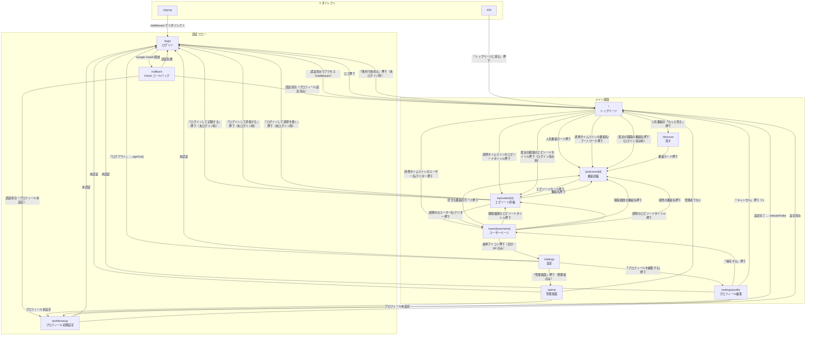
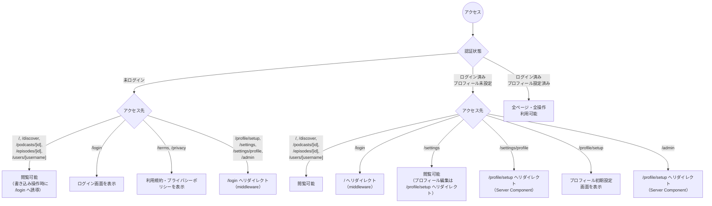
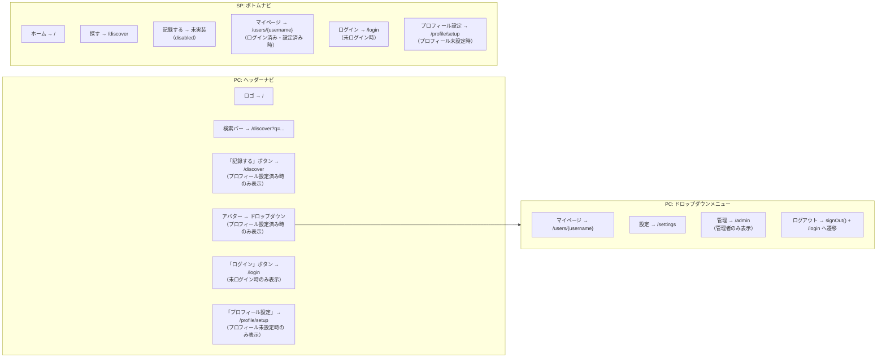

# 画面仕様書

## 概要

PodLog フロントエンドの全画面仕様を定義する。各画面について目的、URL、表示要素、ユーザー操作、認証要否、SP / PC の違いを記載する。

レイアウトの詳細（配置・サイズ・余白）は v0 / Figma でデザインし、スクショを `designs/` に保存して本ドキュメントから参照する。

### 参照ドキュメント

- `docs/requirements.md`（機能要件書）
- `docs/ux-guideline.md`（UX ガイドライン）
- `docs/design-guideline.md`（デザインガイドライン）

### 設計方針

- **フルオープン型**: 閲覧系の画面はすべて認証不要。書き込み操作のみログインを必須とする
- **Google ソーシャルログイン**: メール+パスワード認証は MVP では提供しない
- **SP / PC で UI を分ける**: SP はボトムナビ、PC はヘッダーナビでそれぞれ最適な UX を提供する
- **アプリライクな体験**: SP ではモバイルアプリに近い操作性を目指す

---

## 画面一覧


| #   | 画面名         | URL                 | 認証  | レイアウト | indexable | 備考 |
| --- | ----------- | ------------------- | --- | ----- | --- | --- |
| 1   | トップページ（ホーム） | `/`                 | 不要  | main  | Y | |
| 2   | ログイン        | `/login`            | 不要  | auth  | N | 認証フロー |
| 3   | プロフィール初期設定  | `/profile/setup`    | 必要  | main  | N | ログイン後限定 |
| 4   | 探す          | `/discover`         | 不要  | main  | Y | |
| 5   | 番組詳細        | `/podcasts/[id]`    | 不要  | main  | Y | |
| 6   | エピソード詳細     | `/episodes/[id]`    | 不要  | main  | Y | |
| 7   | ユーザーページ     | `/users/[username]` | 不要  | main  | Y | |
| 8   | プロフィール編集    | `/settings/profile` | 必要  | main  | N | 個人設定 |
| 9   | 設定          | `/settings`         | 必要  | main  | N | 個人設定 |
| 10  | 管理画面        | `/admin`            | 必要（管理者のみ） | main  | N | 管理者のみ |
| 11  | 利用規約        | `/terms`            | 不要  | 独自（ロゴ + コンテンツ） | Y | ナビゲーションなし |
| 12  | プライバシーポリシー  | `/privacy`          | 不要  | 独自（ロゴ + コンテンツ） | Y | ナビゲーションなし |
| -   | 記録する        | `/record`           | 必要  | main  | N | **未実装** |


### レイアウト種別

- **auth**: ナビゲーションなし。ヘッダーにロゴのみ表示する中央寄せレイアウト
- **main**: SP はボトムナビ、PC はヘッダーを表示。コンテンツは中央寄せ（`max-w-5xl`）
- **独自**: ナビゲーションなし。ヘッダーにロゴを表示し、コンテンツは `max-w-3xl` で中央寄せ

### indexable（検索エンジンへの表示可否）

- **Y**: 明示的な noindex を設定しない（Next.js のデフォルトでクローラはインデックス可能）。将来 `app/robots.ts` で Production のみ `allow: "/"` に切り替える方針
- **N**: `robots: { index: false, follow: false }` を設定し、検索エンジンにインデックスされないようにする。個人設定ページ・認証フロー・管理者限定ページ等、公開に意味がないページは N にする
- `robots.txt` / `sitemap.xml` の詳細は workspace の `docs/requirements.md` 3.9 節「OGP / SEO 対応」を参照

### リダイレクトページ

以下のパスは画面を持たず、別のページにリダイレクトする。

| パス | リダイレクト先 | 方式 |
| --- | --- | --- |
| `/signup` | `/login` | middleware |
| `/profile` | `/settings/profile` | Server Component（`redirect()`） |

---

## 画面遷移図

### 全体遷移図

アプリ内の全画面間の遷移を示す。矢印のラベルは遷移のトリガー（ユーザー操作や条件）を表す。



> **※1** 実装上は `router.back()` で前のページに戻る。遷移先は固定ではない。

### 認証状態による分岐

認証状態（未ログイン / ログイン済み・プロフィール未設定 / ログイン済み・設定済み）に応じた画面の振る舞いを示す。



### ナビゲーションからの遷移

PC（ヘッダーナビ）と SP（ボトムナビ）でナビゲーション構成が異なる。



### 補足

- `/signup` は middleware で `/login` にリダイレクトされる（Google 認証のみのため統合）。`/signup/page.tsx` にもフォールバックとして `redirect("/login")` が実装されている
- PC ヘッダーの「記録する」ボタンは、現在 `/discover` へ遷移する。`/record` ページの実装後に遷移先が変更される予定
- SP ボトムナビの「記録する」タブは、`/record` ページ未実装のため現在 disabled 状態
- `/profile` は `/settings/profile` へリダイレクトされる（#127 で統一済み）
- OAuth コールバック (`/callback`) は `next` クエリパラメータでリダイレクト先を指定できるが、現在のログイン実装では常に `/`（デフォルト値）へリダイレクトする。プロフィール未設定の場合は `/profile/setup` へリダイレクトする
- SettingsClient のログアウト処理は `signOut()` 後に `window.location.href = "/login"` で遷移する
- Navbar ドロップダウンのログアウトは `signOut()` 後に `router.push("/login")` で `/login` へ遷移する

---

## ナビゲーション

### SP（モバイル）: ボトムナビゲーション

ハンバーガーメニューを廃止し、ボトムナビを採用する。


| タブ    | アイコン             | 遷移先                 | 役割                 |
| ----- | ---------------- | ------------------- | ------------------ |
| ホーム   | Home             | `/`                 | タイムライン。自分に関連する情報   |
| 探す    | Search           | `/discover`         | 検索・おすすめ。新しい番組との出会い |
| 記録する  | Plus             | 未実装（disabled）       | 聴いた番組の記録に特化した導線    |
| マイページ | User             | `/users/{username}` | 聴取履歴・評価・感想・プロフィール  |


**ルール:**

- タブは **4つ固定**。アイコン + ラベル（テキスト）を併記
- アクティブタブはローズピンク（`rose-500`）で強調
- 未ログイン時:「マイページ」タブは「ログイン」に変わり `/login` へ遷移
- プロフィール未設定時:「マイページ」タブは「プロフィール設定」に変わり `/profile/setup` へ遷移
- ローディング中:「マイページ」タブはリンクなし（`href: null`）で表示
- 記録する」タブは disabled 状態（`/record` 未実装のため）

### PC（デスクトップ）: ヘッダーナビゲーション


| 要素        | 位置        | 内容                             |
| --------- | --------- | ------------------------------ |
| ロゴ        | 左         | 「PodLog」画像。クリックで `/` へ遷移       |
| 検索バー      | 中央        | キーワード入力で `/discover?q=...` へ遷移 |
| 「＋ 記録する」ボタン | 右（プロフィール設定済み） | `/discover` へ遷移（`/record` 実装後に変更予定） |
| アバター      | 右（プロフィール設定済み） | クリックでドロップダウンメニュー               |
| 「プロフィール設定」ボタン | 右（プロフィール未設定） | `/profile/setup` へ遷移 |
| 「ログイン」ボタン | 右（未ログイン）  | `/login` へ遷移                   |


**アバタードロップダウン（プロフィール設定済み時）:**

- 表示名、@username（管理者の場合は AdminBadge を表示）
- マイページ → `/users/{username}`
- 設定 → `/settings`
- 管理 → `/admin`（管理者のみ表示）
- ログアウト → `signOut()` 後 `/login` へ遷移

---

## 1. トップページ（ホーム）

- **URL**: `/`
- **認証**: 不要
- **目的**: サービスの入り口。未ログインユーザーにはサービスの魅力を伝え登録を促す。ログイン済みユーザーにはパーソナライズされたホーム画面を表示する
- **デザイン（SP）**: TODO — `designs/home-sp.png`
- **デザイン（PC）**: TODO — `designs/home-pc.png`

### 表示要素（未ログイン時）

- **ヒーローセクション**: キャッチコピー、サービスの簡単な説明、「無料で始める」ボタン
- **特徴紹介セクション**: PodLog の3つの特徴（聴いた記録を残す / 感想を投稿する / 新しい番組と出会う）
- **人気番組セクション**: 評価件数の多い番組をグリッドで表示（「もっと見る」で `/discover` へ遷移）
- **感想タイムラインセクション**: 「みんなの感想」として全ユーザーの最新の感想を表示
- **CTA セクション**: ページ下部に再度「無料で始める」ボタン

> **UI 再設計について（podlog-workspace#60）**: ヒーロー / 「みんなの感想」セクションの構成・並び・カードレイアウトは、コアコンセプト転換に合わせて別 Issue で再設計する予定。本仕様書はデータソース切替（reviews → comments）と表記の最低限の整合のみを定義する。

### 表示要素（ログイン済み・プロフィール設定済み時）

- **挨拶セクション**: 「{表示名} さん、こんにちは」のような挨拶メッセージ
- **最近の聴取セクション**: ユーザーが最近記録したエピソードの一覧
- **人気番組セクション**: 評価件数の多い番組をグリッドで表示
- **感想タイムラインセクション**: 全ユーザーの最新の感想を表示

### 感想カードの表示項目

- ポッドキャストのアートワーク画像
- 投稿者のアバター、ユーザー名
- エピソードタイトル、番組名
- 感想本文（テキスト、最大 1000 字）
- 投稿日時

> **注**: 旧モデルの「レビューカード」では星評価とコメントを同じカード内に表示していたが、新モデルでは評価と感想は独立した別オブジェクトのため、タイムラインのカードには**感想本文のみ**を表示する。星評価は番組詳細・エピソード詳細の集計値（平均評価・件数）として別 UI で見せる。

### SP / PC の違い


| 要素                | SP      | PC           |
| ----------------- | ------- | ------------ |
| ナビゲーション           | ボトムナビ   | ヘッダー         |
| 感想カード             | 1カラム    | 2カラム         |
| ヒーローセクション（未ログイン時） | コンパクト表示 | 横幅を活かしたレイアウト |


### ユーザー操作


| 操作                      | 挙動                      |
| ----------------------- | ----------------------- |
| 「無料で始める」押下（未ログイン時）    | Google 認証フローを開始         |
| エピソードタイトル押下             | `/episodes/[id]` へ遷移    |
| 番組名 / アートワーク押下          | `/podcasts/[id]` へ遷移    |
| ユーザー名 / アバター押下          | `/users/[username]` へ遷移 |
| 「もっと見る」押下（感想タイムライン）    | 次のページの感想を読み込み           |
| 人気番組の「もっと見る」押下          | `/discover` へ遷移         |
| 最近の聴取のエピソードタイトル押下（ログイン済み時） | `/episodes/[id]` へ遷移 |
| 最近の聴取の番組名押下（ログイン済み時）    | `/podcasts/[id]` へ遷移    |


### 状態別表示


| 状態       | 表示                |
| -------- | ----------------- |
| ローディング   | 各セクションにスケルトン表示    |
| 感想 0 件   | 「まだ感想はありません」      |
| エラー      | エラーメッセージ表示        |


---

## 2. ログイン

- **URL**: `/login`
- **認証**: 不要
- **目的**: Google アカウントでのログイン / 新規登録
- **デザイン（SP）**: TODO — `designs/login-sp.png`
- **デザイン（PC）**: TODO — `designs/login-pc.png`

MVP では Google ソーシャルログインのみ提供する。新規登録とログインを同一画面で扱う。

### 表示要素

- ヘッダーにロゴ「PodLog」画像を表示（クリックで `/` へ遷移）
- 「PodLog にログイン」見出し
- サービスの簡単な説明テキスト
- 「Google アカウントで続ける」ボタン
- アカウント未登録時の自動登録の案内テキスト
- 利用規約・プライバシーポリシーへの同意文言とリンク（`/terms`, `/privacy`）
- サービス特徴の3ポイント紹介（聴いた記録を残す / 感想を投稿する / 新しい番組と出会う）
- ナビゲーション（ボトムナビ / ヘッダーナビ）は表示しない

### SP / PC の違い


| 要素    | SP      | PC                      |
| ----- | ------- | ----------------------- |
| レイアウト | 全画面中央寄せ | カード型で中央配置（max-width 制限） |


### ユーザー操作


| 操作                    | 挙動                                                                        |
| --------------------- | ------------------------------------------------------------------------- |
| ロゴ押下                  | `/` へ遷移                                                                   |
| 「Google アカウントで続ける」押下  | Google OAuth 認証フローを開始。認証成功後、プロフィール未設定なら `/profile/setup` へ、設定済みなら `/` へ遷移 |


### 状態別表示


| 状態          | 表示                 |
| ----------- | ------------------ |
| 認証処理中       | ボタンが無効化され、ローディング表示 |
| エラー         | ボタン上部にエラーメッセージ表示   |
| ログイン済みでアクセス | `/` へリダイレクト（middleware） |


---

## 3. プロフィール初期設定

- **URL**: `/profile/setup`
- **認証**: 必要
- **目的**: 新規登録後のプロフィール初期設定（ユーザー名・表示名の必須設定）
- **デザイン（SP）**: TODO — `designs/profile-setup-sp.png`
- **デザイン（PC）**: TODO — `designs/profile-setup-pc.png`

### 表示要素

- 「プロフィール設定」見出し、説明テキスト
- ユーザー名入力フィールド（注意書き: 英数字とアンダースコア、3〜30文字、変更不可）
- 表示名入力フィールド
- 「設定を完了する」ボタン

### SP / PC の違い


| 要素    | SP     | PC        |
| ----- | ------ | --------- |
| レイアウト | 全幅フォーム | カード型で中央配置 |


### ユーザー操作


| 操作          | 挙動                 |
| ----------- | ------------------ |
| 「設定を完了する」押下 | プロフィール作成 → `/` へ遷移 |


### バリデーション

- ユーザー名: 必須、3〜30文字、英数字とアンダースコアのみ、一意であること
- 表示名: 必須

### 状態別表示


| 状態              | 表示                |
| --------------- | ----------------- |
| 未認証             | `/login` へリダイレクト  |
| プロフィール設定済み      | `/` へリダイレクト       |
| ユーザー名が既に使用されている | フィールド下にエラーメッセージ   |
| エラー             | フォーム上部にエラーメッセージ表示 |
| 送信中             | ボタンが無効化される        |


---

## 4. 探す

- **URL**: `/discover`
- **認証**: 不要
- **目的**: 新しい番組に出会う場所。キーワード検索、ジャンル別ブラウズ、人気番組の一覧を提供する
- **デザイン（SP）**: TODO — `designs/discover-sp.png`
- **デザイン（PC）**: TODO — `designs/discover-pc.png`

### 表示要素

- **検索バー**: 番組名でのキーワード検索
- **ジャンルチップセクション**: 検索バーの直下にジャンルチップ（タグ）を横並びで表示する。先頭に「すべて」チップを配置し、その後ろにジャンル一覧が続く。ジャンル一覧は API から取得する
- **人気の番組セクション**: 評価件数の多い番組を一覧表示（検索キーワードが空かつジャンル未選択の時に表示）
- **ジャンル別番組セクション**: ジャンルチップ選択時に、そのジャンルに属する番組を一覧表示する
- **検索結果セクション**: 検索キーワード入力後に表示

### 番組カードの表示項目

- 番組アートワーク
- 番組タイトル
- 配信者名
- 平均評価、評価件数

### SP / PC の違い


| 要素       | SP          | PC             |
| -------- | ----------- | -------------- |
| 検索バー     | ページ上部に配置    | ヘッダーの検索バーと連動   |
| ジャンルチップ  | 横スクロール（1行）  | 折り返し表示         |
| 番組カード    | 1カラム（リスト表示） | 2〜3カラム（グリッド表示） |


### ユーザー操作


| 操作           | 挙動                                                           |
| ------------ | ------------------------------------------------------------ |
| 検索入力 + Enter キー押下 | Enter キー押下でアプリ内 DB を検索。結果を表示。入力を空にすると検索結果をクリア              |
| ジャンルチップ押下    | 選択したジャンルで番組を絞り込み表示。「すべて」押下で絞り込み解除。1つだけ選択可能（複数選択は不可） |
| 番組カード押下      | `/podcasts/[id]` へ遷移                                         |


### 状態別表示


| 状態              | 表示                          |
| --------------- | --------------------------- |
| 初期（未検索・ジャンル未選択） | 人気の番組セクションを表示               |
| ジャンル選択中          | 選択中のチップをローズピンク（`rose-500`）で強調。そのジャンルの番組一覧を表示 |
| ローディング           | 検索バーにスピナー表示                 |
| 結果あり             | 番組カードの一覧                    |
| 結果なし             | 「検索結果が見つかりませんでした」           |
| エラー              | エラーメッセージ表示                  |


### 検索とジャンル選択の組み合わせルール

探す画面には「初期（未検索・ジャンル未選択）」「ジャンル選択中」「検索中」の3状態がある。検索とジャンル選択は排他的に動作し、同時に有効にはならない。

| 操作 | 挙動 |
| --- | --- |
| ジャンル選択中に検索テキストを入力 | 検索が優先される。ジャンル選択を解除し、検索結果を表示する |
| 検索中にジャンルチップを押下 | ジャンル選択が優先される。検索テキストをクリアし、そのジャンルの番組一覧を表示する |
| 検索テキストを空にする（ジャンル未選択時） | 初期状態に戻り、人気の番組セクションを表示する |

### 段階的な拡充


| フェーズ    | 探す画面の内容                    |
| ------- | -------------------------- |
| MVP     | キーワード検索 + 人気番組の一覧 + ジャンル別ブラウズ（ジャンルチップによる絞り込み） |
| Phase 2 | ランキング（週間・月間）、番組追加リクエスト     |
| Phase 3 | パーソナライズされたおすすめ（レコメンドエンジン）  |


---

## 5. 番組詳細

- **URL**: `/podcasts/[id]`
- **認証**: 不要
- **目的**: 番組の詳細情報とエピソード一覧の閲覧。番組レベルの評価を確認する
- **デザイン（SP）**: TODO — `designs/podcast-detail-sp.png`
- **デザイン（PC）**: TODO — `designs/podcast-detail-pc.png`

### 表示要素

- **番組情報**: アートワーク、タイトル、配信者名、ジャンルタグ、**平均評価（評価件数）**、**感想件数**、説明文
- **エピソード一覧**: エピソードカードのリスト、「もっと見る」ボタン

> **評価と感想の表示**: 番組詳細では「平均評価 ★X.X（評価 N 件）」と「感想 M 件」を別々の指標として並べて表示する。評価と感想は独立しているため、件数の合計を取らず別々に見せる。

### エピソードカードの表示項目

- エピソードタイトル
- 公開日、再生時間
- 平均評価、評価件数、感想件数
- 説明文（2行まで）

### SP / PC の違い


| 要素      | SP                | PC                  |
| ------- | ----------------- | ------------------- |
| 番組情報    | アートワーク + テキストを縦並び | アートワーク左 + テキスト右の横並び |
| エピソード一覧 | 1カラム              | 1カラム（幅広）            |


### ユーザー操作


| 操作         | 挙動                   |
| ---------- | -------------------- |
| エピソードカード押下 | `/episodes/[id]` へ遷移 |
| 「もっと見る」押下  | 次のページのエピソードを読み込み     |


### 状態別表示


| 状態        | 表示              |
| --------- | --------------- |
| ローディング    | ローディング表示        |
| 番組未発見     | 「番組が見つかりませんでした」 |
| エピソード 0 件 | 「エピソードはまだありません」 |
| エラー       | エラーメッセージ表示      |


---

## 6. エピソード詳細

- **URL**: `/episodes/[id]`
- **認証**: 不要（閲覧）。聴取記録・評価投稿・感想投稿はログイン必須
- **目的**: エピソードの詳細閲覧、聴取記録の追加/取り消し、**評価**の付与・編集・削除、**感想**の閲覧・投稿・編集・削除
- **デザイン（SP）**: TODO — `designs/episode-detail-sp.png`
- **デザイン（PC）**: TODO — `designs/episode-detail-pc.png`

### 表示要素

- **番組リンク**: アートワーク + 番組名（番組詳細への導線）
- **エピソード情報**: タイトル、公開日、再生時間、平均評価（評価件数）、感想件数
- **聴取記録ボタン**: 「聴いたにする」/「聴いた」トグル
- **説明文**
- **評価セクション（コンパクト）**:
  - 平均評価 ★X.X（評価 N 件）と星評価ヒストグラム（任意）
  - 自分の評価入力 UI（星をクリックして 1〜5 選択 → 即時投稿）。投稿済みなら現在の星にハイライト
  - 自分の評価がある場合: 「評価を削除」ボタンを近くに配置（評価のみが消え、感想は残る）
- **感想セクション（メイン）**:
  - 感想投稿フォーム（X 風の短文投稿 UI を想定。1000 字までは入るが、長文を強制しない）
  - 感想一覧（投稿日時の新しい順）
  - 自分の感想カードには「編集」「削除」ボタンを表示（**該当の 1 件のみ**を編集・削除）
  - 「もっと見る」ボタンで追加読み込み

> **評価と感想の独立性**: 評価と感想は完全に独立した別オブジェクトとして操作する。
> - 評価を削除しても、自分の感想（同一エピソードに 0〜複数件）には**影響しない**
> - 感想を 1 件削除しても、自分の評価や他の感想には**影響しない**
> - 同一エピソードに **「評価のみ」「感想のみ」「評価＋感想」「感想を複数件」**のいずれの組み合わせも可能

### 未ログイン時の違い

- 「聴いたにする」ボタンの代わりに「ログインして記録する」を表示
- 評価セクションの星入力 UI の代わりに「ログインして評価する」を表示（平均評価・件数の表示は維持）
- 感想投稿フォームの代わりに「ログインして感想を書く」を表示
- 感想一覧は閲覧可能

### SP / PC の違い


| 要素       | SP       | PC              |
| -------- | -------- | --------------- |
| レイアウト    | 1カラム、縦並び | コンテンツ幅を制限した1カラム |
| 評価セクション  | エピソード情報の直下にコンパクトに配置 | 同左 |
| 感想セクション  | 評価セクションの下、メインコンテンツとして縦展開 | 同左 |
| 感想フォーム   | 全幅       | 幅を制限            |


### ユーザー操作


| 操作                          | 挙動                                  |
| --------------------------- | ----------------------------------- |
| 番組名押下                       | `/podcasts/[id]` へ遷移                |
| 「聴いたにする」押下                  | 聴取記録を追加、ボタンが「聴いた」に変化                |
| 「聴いた」押下                     | 聴取記録を取り消し、ボタンが「聴いたにする」に変化           |
| 星をクリック（評価セクション）             | 評価を選択（1〜5）。即時に作成または更新（既存評価がなければ作成） |
| 「評価を削除」押下                   | 確認表示後、**自分の評価のみ**を削除（自分の感想は残る）      |
| 感想フォームに本文入力 → 「投稿する」押下      | 感想を新規作成、感想一覧の先頭に追加                  |
| 感想カードの「編集」押下（自分の感想のみ）       | **その感想 1 件のみ**を編集モードに切替             |
| 感想カードの「削除」押下（自分の感想のみ）       | 確認表示後、**その感想 1 件のみ**を削除             |
| 感想内のユーザー名 / アバター押下          | `/users/[username]` へ遷移             |
| 感想セクションの「もっと見る」押下           | 次のページの感想を読み込み                       |
| 「ログインして記録する」押下（未ログイン時）      | `/login` へ遷移                        |
| 「ログインして評価する」押下（未ログイン時）      | `/login` へ遷移                        |
| 「ログインして感想を書く」押下（未ログイン時）     | `/login` へ遷移                        |


### バリデーション

- 評価: 1〜5 の整数（評価セクションでの星クリックで自動付与）
- 感想: 必須、1〜1000 文字（空文字での投稿は不可）

### 状態別表示


| 状態         | 表示                   |
| ---------- | -------------------- |
| ローディング     | ローディング表示             |
| エピソード未発見   | 「エピソードが見つかりませんでした」   |
| 聴取記録トグル中   | ボタンにスピナー表示           |
| 評価投稿成功     | 星にハイライト + 平均評価が更新（メッセージは出さず即時反映） |
| 評価削除成功     | 星のハイライト解除 + 平均評価が更新  |
| 感想投稿成功     | 「感想を投稿しました」メッセージ表示、フォームをクリアし一覧の先頭に追加 |
| 感想 0 件     | 「まだ感想はありません」          |
| エラー        | エラーメッセージ表示           |


---

## 7. ユーザーページ

- **URL**: `/users/[username]`
- **認証**: 不要
- **目的**: ユーザーの公開プロフィール、好きな番組、聴取履歴、評価サマリー、感想一覧の閲覧
- **デザイン（SP）**: TODO — `designs/user-page-sp.png`
- **デザイン（PC）**: TODO — `designs/user-page-pc.png`

### 表示要素

- **プロフィールセクション**: アバター、表示名、@username、自己紹介
- **好きな番組セクション**: 番組アートワーク + 番組名の横並びリスト
- **聴取履歴セクション**: エピソードタイトル、番組名、記録日
- **評価サマリーセクション（統計のみ）**:
  - 「N 件評価 / 平均 ★X.X」のサマリー表示
  - 星別のヒストグラム（1〜5 の各星に該当する件数）を任意で表示
  - **個別の評価レコードは表示しない**（後述）
- **感想セクション**: エピソードタイトル、番組名、感想本文、投稿日（1ユーザー1エピソードに複数件あり得る）

聴取履歴・感想セクションには「もっと見る」ボタンあり。

> **評価サマリーのみ表示する設計判断**: 旧モデル（reviews）ではユーザーページに「rating + comment が同居したレビュー一覧」を表示していたが、新モデルでは性質の異なる 2 種を分離する:
> - **評価**: 星のみで情報量が小さく、誰が何に星を付けたかの羅列はノイズになりやすい → サマリー（統計）に集約
> - **感想**: 本文中心で読み物として価値がある → 一覧表示する
>
> ユーザーの「最近聴いてるラジオを友達に共有する」という用途では、感想一覧があれば十分で、評価の個別履歴は不要。集計値だけ見せて「どれくらい・どの傾向で評価しているか」を伝える。

### SP / PC の違い


| 要素        | SP              | PC                |
| --------- | --------------- | ----------------- |
| プロフィール    | アバター中央、テキスト中央寄せ | アバター左 + テキスト右の横並び |
| 好きな番組     | 横スクロール          | グリッド表示            |
| 評価サマリー    | サマリー数値 + ヒストグラム横並び | 同左（幅広） |
| 聴取履歴・感想   | 1カラム            | 1カラム（幅広）          |


### ユーザー操作


| 操作               | 挙動                   |
| ---------------- | -------------------- |
| 好きな番組のカード押下      | `/podcasts/[id]` へ遷移 |
| 聴取履歴のエピソードタイトル押下 | `/episodes/[id]` へ遷移 |
| 聴取履歴の番組名押下       | `/podcasts/[id]` へ遷移 |
| 感想のエピソードタイトル押下   | `/episodes/[id]` へ遷移 |
| 感想の番組名押下         | `/podcasts/[id]` へ遷移 |
| 各セクションの「もっと見る」押下 | 次のページを読み込み           |


### 状態別表示


| 状態         | 表示                |
| ---------- | ----------------- |
| ローディング     | ローディング表示          |
| ユーザー未発見    | 「ユーザーが見つかりませんでした」 |
| 好きな番組 0 件  | セクション非表示          |
| 聴取履歴 0 件   | 「まだ聴取記録がありません」    |
| 評価 0 件     | 評価サマリー: 「まだ評価がありません」（数値・ヒストグラム非表示） |
| 感想 0 件     | 「まだ感想がありません」      |
| エラー        | エラーメッセージ表示        |


---

## 8. プロフィール編集

- **URL**: `/settings/profile`
- **認証**: 必要
- **目的**: 表示名・アバター・自己紹介・好きな番組の編集
- **デザイン（SP）**: TODO — `designs/profile-edit-sp.png`
- **デザイン（PC）**: TODO — `designs/profile-edit-pc.png`

### 表示要素

- **アバター編集**: 現在のアバター表示 + 「画像を変更する」ボタン
- **表示名入力フィールド**
- **自己紹介入力フィールド**（テキストエリア）
- **好きな番組セクション**: 登録済み番組（削除可能）+ 「追加」ボタン
- **アクションボタン**: 「キャンセル」「保存する」

### SP / PC の違い


| 要素    | SP     | PC        |
| ----- | ------ | --------- |
| レイアウト | 全幅フォーム | カード型で中央配置 |
| 好きな番組 | 横スクロール | グリッド表示    |


### ユーザー操作


| 操作          | 挙動                                 |
| ----------- | ---------------------------------- |
| 「画像を変更する」押下 | ファイル選択ダイアログを表示                     |
| 「追加」押下      | 番組検索ダイアログを表示                       |
| 検索ダイアログで番組名入力 + Enter キー押下 | 入力内容でアプリ内 DB を検索。IME 変換中の Enter は無視 |
| 検索ダイアログで入力を空にする | 検索結果をクリア（未検索状態に戻る） |
| 検索結果の番組押下 | 「好きな番組」リストに追加し、ダイアログを閉じる（追加済みは押下不可） |
| 番組の「×」押下    | 好きな番組リストから削除                       |
| 「保存する」押下    | プロフィール更新 → `/users/{username}` へ遷移 |
| 「キャンセル」押下   | 変更を破棄して前の画面に戻る                     |


### バリデーション

- 表示名: 必須
- アバター画像: JPEG / PNG、ファイルサイズ上限あり

### 状態別表示


| 状態        | 表示                |
| --------- | ----------------- |
| ローディング    | ローディング表示          |
| 未認証       | `/login` へリダイレクト  |
| プロフィール未設定 | `/profile/setup` へリダイレクト（Server Component） |
| 画像アップロード中 | アバターエリアにスピナー表示    |
| 保存成功      | ユーザーページへ遷移        |
| エラー       | フォーム上部にエラーメッセージ表示 |


---

## 9. 設定

- **URL**: `/settings`
- **認証**: 必要
- **目的**: アカウント情報の確認、プロフィール編集への導線、ログアウト
- **デザイン（SP）**: TODO — `designs/settings-sp.png`
- **デザイン（PC）**: TODO — `designs/settings-pc.png`

### 表示要素

- **アカウント情報カード**（プロフィール設定済み時のみ表示）: ユーザー名、表示名、ログイン方法（Google）
- **「プロフィールを編集する」リンク** → `/settings/profile`（説明テキスト付き）
- **「管理画面」リンク** → `/admin`（管理者のみ表示。ShieldCheckIcon 付き）
- **「ログアウト」ボタン**
- **利用規約・プライバシーポリシーへのリンク**（ページ下部）

### SP / PC の違い


| 要素     | SP          | PC               |
| ------ | ----------- | ---------------- |
| アクセス方法 | ユーザーページの歯車アイコン経由 | ヘッダーのドロップダウンから遷移 |
| レイアウト  | 全幅          | カード型で中央配置        |


### ユーザー操作


| 操作              | 挙動                      |
| --------------- | ----------------------- |
| 「プロフィールを編集する」押下 | `/settings/profile` へ遷移 |
| 「管理画面」押下（管理者のみ） | `/admin` へ遷移            |
| 「ログアウト」押下       | ログアウト処理 → `/login` へ遷移  |


### 状態別表示


| 状態     | 表示               |
| ------ | ---------------- |
| ローディング | ローディング表示         |
| 未認証    | `/login` へリダイレクト |


---

## 10. 管理画面

- **URL**: `/admin`
- **認証**: 必要（管理者のみ）
- **目的**: 番組・エピソードの手動登録など管理者向けの機能を提供する
- **デザイン**: なし（管理用の内部ツール）

### アクセス制御

Server Component で以下の順にチェックする:
1. 未認証 → `/login` へリダイレクト
2. プロフィール未設定 → `/profile/setup` へリダイレクト
3. `is_admin` が `false` → `/` へリダイレクト

### 表示要素

- **見出し**: 「管理画面」（ShieldCheckIcon 付き）
- **タブ切り替え**: 「番組登録」「エピソード登録」
- **番組登録フォーム**: 番組の手動登録
- **エピソード登録フォーム**: エピソードの手動登録

### ユーザー操作

| 操作 | 挙動 |
| --- | --- |
| タブ切り替え | 「番組登録」「エピソード登録」フォームを切り替え |
| フォーム送信 | 番組 or エピソードを API 経由で登録 |

---

## 11. 利用規約

- **URL**: `/terms`
- **認証**: 不要
- **目的**: サービスの利用規約を表示する
- **レイアウト**: ナビゲーションなし。ヘッダーにロゴ画像のみ表示

### 表示要素

- ロゴ（クリックで `/` へ遷移）
- 「利用規約」見出し
- 最終更新日
- 規約本文（第1条〜第9条）
- ログインページへのリンク

---

## 12. プライバシーポリシー

- **URL**: `/privacy`
- **認証**: 不要
- **目的**: プライバシーポリシーを表示する
- **レイアウト**: ナビゲーションなし。ヘッダーにロゴ画像のみ表示

### 表示要素

- ロゴ（クリックで `/` へ遷移）
- 「プライバシーポリシー」見出し
- 最終更新日
- ポリシー本文（全9セクション）
- ログインページへのリンク

---

## 記録する（未実装）

- **URL**: `/record`
- **認証**: 必要
- **目的**: 聴いた番組の記録に特化した画面。毎週聴くラジオの最新回にすぐアクセスし、記録・評価・感想投稿を効率的に行う
- **状態**: **未実装**。PC ヘッダーの「記録する」ボタンは暫定的に `/discover` へ遷移、SP ボトムナビの「記録する」タブは disabled 状態

### 「探す」との違い

- **探す**: 新しい番組に出会う（ブラウズ・発見）
- **記録する**: 聴いた番組が決まっている人が、すばやく記録する

ラジオは同じ番組を毎週聴くため、毎回「検索 → 番組 → エピソード一覧 → 最新回」とたどるのは手間が大きい。記録ページはこの手間を解消する。

### 表示要素（MVP）

- **最近記録した番組の新着**: 過去に記録した番組の中で、まだ記録していない新着エピソードを表示する
- **番組検索**: 記録目的で番組を検索し、エピソードを選択して記録する

### 表示要素（Phase 2）

- **よく聴く番組のショートカット**: 聴取記録の頻度から自動推薦、または手動ピン留め。最新エピソードにワンタップでアクセス

### SP / PC の違い


| 要素     | SP              | PC                      |
| ------ | --------------- | ----------------------- |
| アクセス方法 | ボトムナビ「＋ 記録する」タブ | ヘッダーに「＋ 記録する」ボタン       |
| レイアウト  | 1カラム            | コンテンツ幅を制限した1カラム         |


### ユーザー操作


| 操作           | 挙動                               |
| ------------ | -------------------------------- |
| 新着エピソードカード押下 | `/episodes/[id]` へ遷移（記録・評価・感想投稿が可能） |
| 番組検索入力 + Enter キー押下 | Enter キー押下でアプリ内 DB を検索。入力を空にすると検索結果をクリア |
| 検索結果の番組カード押下 | その番組のエピソード一覧を表示                  |
| エピソード選択      | `/episodes/[id]` へ遷移             |


### 状態別表示


| 状態           | 表示                                  |
| ------------ | ----------------------------------- |
| ローディング       | ローディング表示                            |
| 未認証          | `/login` へリダイレクト                    |
| 記録履歴なし（初回利用） | 「まずは番組を検索して、聴いたエピソードを記録しましょう」+ 検索バー |
| 新着エピソードなし    | 「新着エピソードはありません」                     |
| エラー          | エラーメッセージ表示                          |


### 記録フロー

```
記録する画面（/record）
  │
  ├─→ 新着エピソードから選択
  │     │
  │     └─→ /episodes/[id] へ遷移
  │           ├─→ 「聴いたにする」で記録
  │           ├─→ 星をクリックして評価
  │           └─→ 感想も書ける（複数件可）
  │
  └─→ 番組検索から選択
        │
        └─→ 番組を選択 → エピソード選択
              │
              └─→ /episodes/[id] へ遷移
                    ├─→ 「聴いたにする」で記録
                    ├─→ 星をクリックして評価
                    └─→ 感想も書ける（複数件可）
```

### 段階的な拡充


| フェーズ    | 記録ページの内容                     |
| ------- | ---------------------------- |
| MVP     | 番組検索 + 最近記録した番組の新着表示         |
| Phase 2 | よく聴く番組のショートカット（自動推薦 or ピン留め） |


---

## 認証フロー

```
未ログイン
  │
  ├─→ /（トップ）→ 「無料で始める」→ Google 認証
  │                                        │
  │                                        ├─→ 初回 → /profile/setup → /
  │                                        └─→ 2回目以降 → /
  │
  ├─→ /login → Google 認証 → 同上
  │
  ├─→ /discover, /podcasts/[id], /episodes/[id], /users/[username]
  │     → 認証なしで閲覧可能
  │     → 書き込み操作時に /login へ誘導
  │
  └─→ /settings, /settings/profile, /admin にアクセス → /login へリダイレクト

ログイン済み・プロフィール未設定
  │
  └─→ 書き込み操作時 → /profile/setup へリダイレクト

ログイン済み・プロフィール設定済み
  │
  └─→ 全ページにアクセス可能、全操作が利用可能
```
